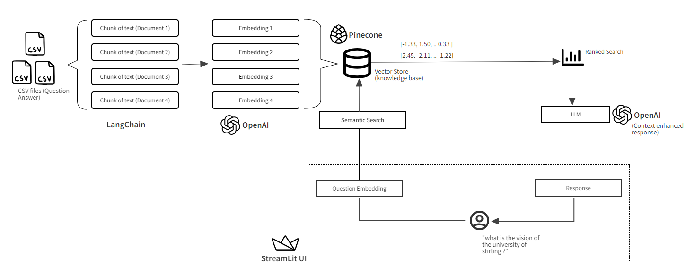
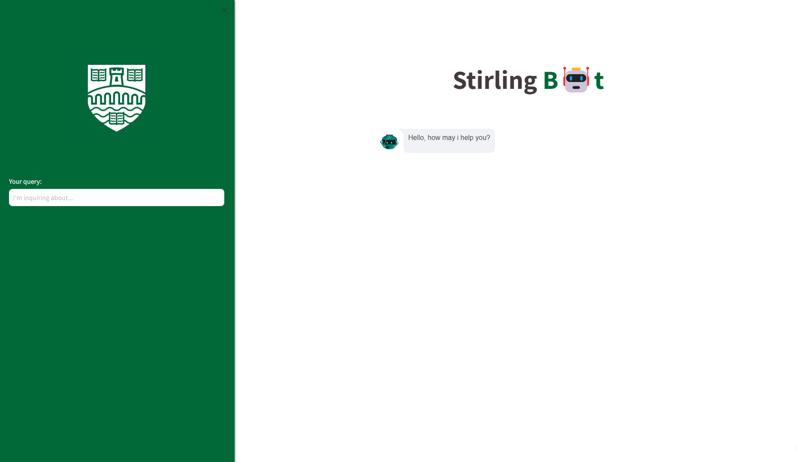
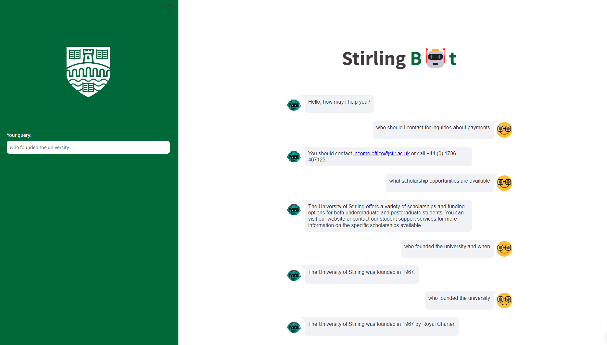
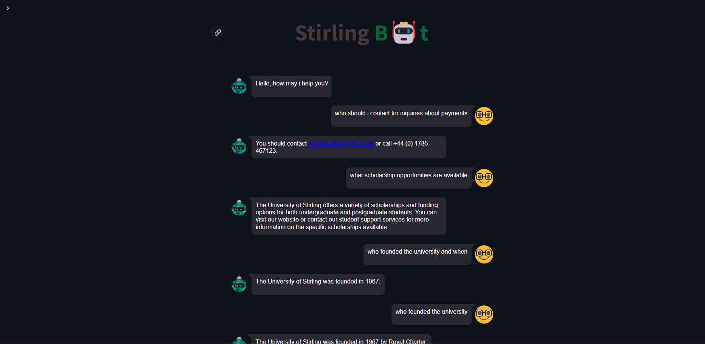
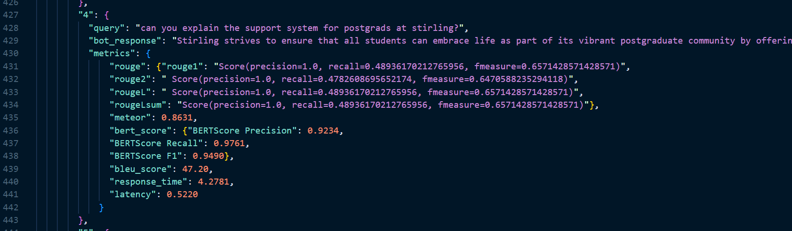

# Stirling B🤖t: Frequently Asked Questions (FAQ) ChatBot for the University of Stirling 🚀

## Introduction

Stirling B🤖t is a FAQ chatbot designed to address frequently asked questions (FAQs) related to the [University of Stirling](https://stirling-bot.onrender.com). It leverages advanced web scraping techniques to gather relevant information from the university's website, as well as extracting relevant information from PDF documents. Stirling B🤖t utilizes powerful Natural Language Processing (NLP) tools to answer user queries in a conversational manner, ensuring a seamless and informative experience.

Access the FAQ Chatbot here: [Stirling Bot](https://stirling-bot.onrender.com)

## Project Goals

- **Enhance User Experience**: Provide a convenient and readily accessible way to find university-related information.
- **Showcase Technical Skills**: Demonstrate web scraping, Large Language Model (LLM) and NLP capabilities using Python.
- **Build an Interactive Interface**: Develop a Streamlit application for a seamless user experience.

## Technical Work

### Architectural diagram


### ETL Pipeline

The project implements a robust ETL (Extraction, Transformation, Loading) pipeline to ensure dynamic data handling.

#### Data Collection (Extraction)
- **Web Scraping**: Data is extracted from the [University of Stirling website](https://www.stir.ac.uk).
- **PDF Data Extraction**: Relevant information is extracted from PDF documents.

#### Data Cleaning and Preprocessing (Transformation and Loading)
- **Data Cleaning**: Remove unnecessary spaces, HTML tags, links, etc.
- **Data Transformation**: Use GPT to transform the data into question-answer pairs.
- **Data Storage**: Save the generated question-answer pairs in a CSV file.

### Developing Large Language Model (LLM)

- **Data Processing**: Chunk the processed CSV data and generate embeddings.
- **Data Storage**: Load the embeddings into a vector database.

## Technologies Used

### Core Programming Language
- **Python**: The backbone of the entire project, providing a versatile and powerful environment for development.

### Environment and Deployment
- **Docker**: Creates containerized environments for consistent and reproducible deployment.

### Web Scraping and Data Extraction
- **Beautiful Soup**: Efficiently extracts FAQ data from the university website.
- **Requests**: Handles HTTP requests to web pages or APIs to fetch HTML content or other data.

### Natural Language Processing and Machine Learning
- **LangChain**: A comprehensive NLP library for text processing, document management, and chatbot development.
- **Pinecone**: A vector database for efficient text retrieval and search.
- **NLTK**: Natural Language Toolkit, useful for working with human language data.
- **OpenAI**: Utilizes a large language model (LLM) to generate human-like responses for enhanced conversational fluency.

### Evaluation Metrics
- **Rouge**: A set of metrics for evaluating automatic summarization and machine translation.
- **Bert_Score**: A metric for evaluating text generation models based on BERT embeddings.

### Web Application Framework
- **Streamlit**: A framework for creating interactive web apps to present the chatbot interface.

### Data Manipulation and Visualization
- **Pandas**: A powerful library for data manipulation and processing.
- **Matplotlib**: A comprehensive library for creating static, animated, and interactive visualizations in Python.

### Document Handling
- **PyPDF2**: Reads and extracts text from PDF documents.

### Configuration Management
- **python-dotenv**: Manages environment variables, loading them from a `.env` file.

### Code Quality and Formatting
- **Isort**: Automatically sorts imports in Python files to maintain a consistent and organized import structure.
- **Black**: Enforces a consistent coding style through automatic code formatting.
- **Flake8**: Checks for compliance with Python coding standards, ensuring clean and error-free code.
- **Rich**: Enhances the command-line interface and debugging output with rich text and formatting.

## Installation

1. Clone this repository:
    ```bash
    git clone https://github.com/edward-mike/multi-language-faq-chatbot.git
    ```
2. Create a virtual environment (recommended) and activate it:
    ```bash
    python -m venv venv
    source venv/bin/activate  # On Windows use `venv\Scripts\activate`
    ```
3. Install dependencies:
    ```bash
    pip install -r requirements.txt
    ```
4. Create a `.env` file. Refer to `.env.example` for the required configuration.

5. Run the app:
    ```bash
    streamlit run main.py
    ```
6. Copy and paste the Local URL: http://localhost:8501 on your browser

## Screenshots

- **Welcome Screen**  
  

- **Conversation Screen**  
  

- **Dark Theme Screen**  
  

- **Collapsed Sidebar Screen**  
  

- **LLM Evaluation output** 
  

## Author
You can connect with me on [Linkedin](https://www.linkedin.com/in/edward-mike/)

## Acknowledgements
To all contributors of open source and free software used in this project, thank you👏

## Future Works
- Implement Multi-language Support: Ensure the system can handle all languages.

- Advanced LLM Evaluation: Develop more sophisticated methods for evaluating large language models.